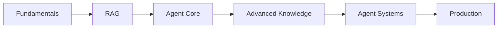

# AI Agent Knowledge Map

## Overview

English is the main teaching language; Traditional Chinese supports key terms. Start with one cluster, read its concept notes, then follow the next-topic links. Examples are illustrative unless a source is explicitly named.

## Learning Route（學習路線）

Fundamentals → RAG → Agent Core → Advanced Knowledge → Agent Systems → Production

## 1. Fundamentals

[[AI Agent Learning/01 - Fundamentals/01 - Fundamentals Overview|Open cluster overview]]

- **[[AI Agent Learning/01 - Fundamentals/AI Agent|AI Agent]]**（人工智能代理）
- **[[AI Agent Learning/01 - Fundamentals/LLM|LLM]]**（大型語言模型）
- **[[AI Agent Learning/01 - Fundamentals/Tokens|Tokens]]**（詞元）
- **[[AI Agent Learning/01 - Fundamentals/Context Window|Context Window]]**（上下文視窗）
- **[[AI Agent Learning/01 - Fundamentals/Prompting|Prompting]]**（提示設計）
- **[[AI Agent Learning/01 - Fundamentals/Structured Output|Structured Output]]**（結構化輸出）

## 2. RAG

[[AI Agent Learning/02 - RAG/02 - RAG Overview|Open cluster overview]]

- **[[AI Agent Learning/02 - RAG/RAG|RAG]]**（檢索增強生成）
- **[[AI Agent Learning/02 - RAG/Embeddings|Embeddings]]**（向量嵌入）
- **[[AI Agent Learning/02 - RAG/Cosine Similarity|Cosine Similarity]]**（餘弦相似度）
- **[[AI Agent Learning/02 - RAG/Vector Database|Vector Database]]**（向量資料庫）
- **[[AI Agent Learning/02 - RAG/Chunking|Chunking]]**（文件分塊）
- **[[AI Agent Learning/02 - RAG/Semantic Search|Semantic Search]]**（語義搜尋）
- **[[AI Agent Learning/02 - RAG/BM25 and Sparse Search|BM25 and Sparse Search]]**（BM25／稀疏搜尋）
- **[[AI Agent Learning/02 - RAG/Hybrid Search|Hybrid Search]]**（混合搜尋）
- **[[AI Agent Learning/02 - RAG/Reciprocal Rank Fusion|Reciprocal Rank Fusion]]**（倒數排名融合）
- **[[AI Agent Learning/02 - RAG/Reranking|Reranking]]**（重新排序）
- **[[AI Agent Learning/02 - RAG/Metadata Filtering|Metadata Filtering]]**（元資料過濾）

## 3. Agent Core

[[AI Agent Learning/03 - Agent Core/03 - Agent Core Overview|Open cluster overview]]

- **[[AI Agent Learning/03 - Agent Core/Tool Calling and Function Calling|Tool Calling and Function Calling]]**（工具／函式調用）
- **[[AI Agent Learning/03 - Agent Core/Planning|Planning]]**（規劃）
- **[[AI Agent Learning/03 - Agent Core/Task Decomposition|Task Decomposition]]**（任務分解）
- **[[AI Agent Learning/03 - Agent Core/ReAct|ReAct]]**（推理與行動）
- **[[AI Agent Learning/03 - Agent Core/Agent State|Agent State]]**（代理狀態）
- **[[AI Agent Learning/03 - Agent Core/Memory|Memory]]**（記憶）
- **[[AI Agent Learning/03 - Agent Core/Short-term Memory|Short-term Memory]]**（短期記憶）
- **[[AI Agent Learning/03 - Agent Core/Long-term Memory|Long-term Memory]]**（長期記憶）
- **[[AI Agent Learning/03 - Agent Core/Episodic Memory|Episodic Memory]]**（情節記憶）
- **[[AI Agent Learning/03 - Agent Core/Semantic Memory|Semantic Memory]]**（語義記憶）
- **[[AI Agent Learning/03 - Agent Core/Reflection and Critic|Reflection and Critic]]**（反思／評審）

## 4. Advanced Knowledge

[[AI Agent Learning/04 - Advanced Knowledge/04 - Advanced Knowledge Overview|Open cluster overview]]

- **[[AI Agent Learning/04 - Advanced Knowledge/Knowledge Graph|Knowledge Graph]]**（知識圖譜）
- **[[AI Agent Learning/04 - Advanced Knowledge/Graph RAG|Graph RAG]]**（圖譜式檢索增強生成）
- **[[AI Agent Learning/04 - Advanced Knowledge/Multi-hop Reasoning|Multi-hop Reasoning]]**（多跳推理）
- **[[AI Agent Learning/04 - Advanced Knowledge/Agentic RAG|Agentic RAG]]**（代理式檢索增強生成）
- **[[AI Agent Learning/04 - Advanced Knowledge/LLM Wiki|LLM Wiki]]**（LLM 維護的知識 Wiki）
- **[[AI Agent Learning/04 - Advanced Knowledge/CAG|CAG]]**（快取增強生成）
- **[[AI Agent Learning/04 - Advanced Knowledge/Multimodal RAG|Multimodal RAG]]**（多模態檢索增強生成）

## 5. Agent Systems

[[AI Agent Learning/05 - Agent Systems/05 - Agent Systems Overview|Open cluster overview]]

- **[[AI Agent Learning/05 - Agent Systems/MCP|MCP]]**（模型上下文協議）
- **[[AI Agent Learning/05 - Agent Systems/Workflow vs Agent|Workflow vs Agent]]**（工作流與代理）
- **[[AI Agent Learning/05 - Agent Systems/Multi-Agent Systems|Multi-Agent Systems]]**（多代理系統）
- **[[AI Agent Learning/05 - Agent Systems/Agent Orchestration|Agent Orchestration]]**（代理編排）
- **[[AI Agent Learning/05 - Agent Systems/Human-in-the-loop|Human-in-the-loop]]**（人工介入）
- **[[AI Agent Learning/05 - Agent Systems/Guardrails|Guardrails]]**（行為與安全限制）
- **[[AI Agent Learning/05 - Agent Systems/SQL and Data Agent|SQL and Data Agent]]**（資料庫／資料代理）
- **[[AI Agent Learning/05 - Agent Systems/Code Agent|Code Agent]]**（程式代理）
- **[[AI Agent Learning/05 - Agent Systems/Browser and Computer Agent|Browser and Computer Agent]]**（瀏覽器／電腦操作代理）

## 6. Production

[[AI Agent Learning/06 - Production/06 - Production Overview|Open cluster overview]]

- **[[AI Agent Learning/06 - Production/Agent Evaluation|Agent Evaluation]]**（代理評估）
- **[[AI Agent Learning/06 - Production/Accuracy|Accuracy]]**（準確率）
- **[[AI Agent Learning/06 - Production/Retrieval Recall|Retrieval Recall]]**（檢索召回率）
- **[[AI Agent Learning/06 - Production/Precision|Precision]]**（精確率）
- **[[AI Agent Learning/06 - Production/Groundedness|Groundedness]]**（證據支持程度）
- **[[AI Agent Learning/06 - Production/Task Success|Task Success]]**（任務成功率）
- **[[AI Agent Learning/06 - Production/Observability and Tracing|Observability and Tracing]]**（可觀測性／追蹤）
- **[[AI Agent Learning/06 - Production/Latency|Latency]]**（延遲）
- **[[AI Agent Learning/06 - Production/Cost|Cost]]**（成本）
- **[[AI Agent Learning/06 - Production/Security|Security]]**（安全性）

## Practical learning project

Build a study assistant in stages:

1. retrieve passages from a small set of notes;
2. compare lexical and semantic retrieval;
3. add a read-only search tool;
4. retain task state;
5. review cited answers;
6. evaluate on a fixed question set.

> [!tip] Keep the project focused
> Add adaptive retrieval or multiple agents only if measurements justify the complexity.

## Related Notes

### Graph and Existing Notes

[[AI Agent Learning/01 - Graph View Guide|01 - Graph View Guide]] explains folder filters, cluster colors, and local graphs. The original notes are preserved: [[AI Agent/LLM|Original LLM]], [[AI Agent/Context Window|Original Context Window]], [[AI Agent/RAG - Retrieval-Augmented Generation|Original RAG]]. Full vault-relative links disambiguate duplicate titles.

## Scope and provenance

This collection expands the concepts in the referenced “Computer Science Tutoring” conversation, including its learning-route items and evaluation metrics. The source response ends mid-sentence; all identifiable topics in the available text are covered. Selected primary references are attached to their relevant concept notes. LLM Wiki is treated as a general maintenance pattern, not an asserted universal specification.
